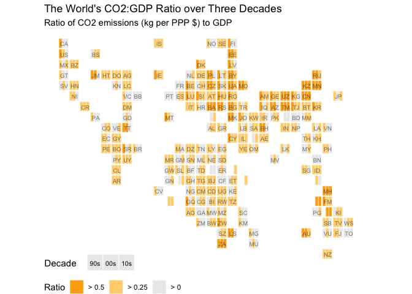

CO2:GDP Ratio Analysis
================
Shray Dewan
2023-09-05

# Set-up

``` r
library(tidyverse)
```

    ## ── Attaching core tidyverse packages ──────────────────────── tidyverse 2.0.0 ──
    ## ✔ dplyr     1.1.3     ✔ readr     2.1.4
    ## ✔ forcats   1.0.0     ✔ stringr   1.5.0
    ## ✔ ggplot2   3.4.3     ✔ tibble    3.2.1
    ## ✔ lubridate 1.9.2     ✔ tidyr     1.3.0
    ## ✔ purrr     1.0.2     
    ## ── Conflicts ────────────────────────────────────────── tidyverse_conflicts() ──
    ## ✖ dplyr::filter() masks stats::filter()
    ## ✖ dplyr::lag()    masks stats::lag()
    ## ℹ Use the conflicted package (<http://conflicted.r-lib.org/>) to force all conflicts to become errors

``` r
library(ggChernoff)
library(grDevices)
library(grid)

regions <- read.csv("~/Documents/GitHub/CO2-GDP-Ratio/Data Files/gapMinderGeo copy 2.csv")
co <- read.csv("~/Documents/GitHub/CO2-GDP-Ratio/Data Files/CO2GDP.csv")
co <- co[-c(2:34,66:68)]
co <- co[rowSums(is.na(co)) <= 50, ] 
theme_set(theme_light())
```

# Map

``` r
co2 <- gather(co, Year, Ratio, X1990:X2020, factor_key=TRUE)
co2$Year <- as.numeric(gsub("X","",co2$Year))
co2 <- na.omit(co2)
```

``` r
squares <- read.csv("~/Documents/GitHub/CO2-GDP-Ratio/Data Files/CountriesSquares.csv")
squares <- na.omit(squares)
squares <- squares[c(1:2,10:11)]
colnames(squares)[1] <- "Country.Name"

#squares_names <- levels(as.factor(squares$name))
#co2_names <- levels(as.factor(co2$Country.Name))
#co2_names[which(!(co2_names %in% squares_names))]
#squares_names[which(!(squares_names %in% co2_names))]

co2 <- mutate(co2, Country.Name=fct_recode(Country.Name,
                                     "Antigua & Barbuda"="Antigua and Barbuda",
                                     "Bahamas"="Bahamas, The",
                                     "Bosnia & Herzegovina"="Bosnia and Herzegovina",
                                     "Congo (Democratic Republic of the)"="Congo, Dem. Rep.",
                                     "Congo"="Congo, Rep.",
                                     "Czech Republic"="Czechia",
                                     "Egypt"="Egypt, Arab Rep.",
                                     "Swaziland"="Eswatini",
                                     "Gambia"="Gambia, The",
                                     "Iran (Islamic Republic of)"="Iran, Islamic Rep.",
                                     "South Korea"="Korea, Rep.",
                                     "Kyrgyzstan"="Kyrgyz Republic",
                                     "Lao People's Democratic Republic"="Lao PDR",
                                     "Micronesia (Federated States of)"="Micronesia, Fed. Sts.",
                                     "Moldova (Republic of)"="Moldova",
                                     "Macedonia"="North Macedonia",
                                     "Slovakia"="Slovak Republic",
                                     "St. Kitts & Nevis"="St. Kitts and Nevis",
                                     "St. Vincent & the Grenadines"="St. Vincent and the Grenadines",
                                     "Trinidad & Tobago"="Trinidad and Tobago",
                                     "Turkey"="Turkiye",
                                     "United States of America"="United States",
                                     "Venezuela"="Venezuela, RB",
                                     "Viet Nam"="Vietnam",
                                     "Yemen"="Yemen, Rep."
                                     ))

co2 <- co2 %>% left_join(squares) %>% na.omit(co2)
```

    ## Joining with `by = join_by(Country.Name)`

``` r
co2.90 <- filter(co2,Year >= 1990 & Year <= 1999)     
co2.00 <- filter(co2,Year >= 2000 & Year <= 2010)    
co2.10 <- filter(co2,Year >= 2010 & Year <= 2019)

co2.90 <- co2.90 %>% group_by(Country.Name, coordinates__001, coordinates__002,
                              alpha.2) %>% reframe(Ratio = mean(Ratio))
co2.00 <- co2.00 %>% group_by(Country.Name, coordinates__001, coordinates__002,
                              alpha.2) %>% reframe(Ratio = mean(Ratio))
co2.10 <- co2.10 %>% group_by(Country.Name, coordinates__001, coordinates__002,
                              alpha.2) %>% reframe(Ratio = mean(Ratio))

co2.90$fill <- ifelse(co2.90$Ratio>=0.5,"> 0.5",ifelse(co2$Ratio>=0.25,
                                                         "> 0.25","> 0"))
co2.00$fill <- ifelse(co2.00$Ratio>=0.5,"> 0.5",ifelse(co2$Ratio>=0.25,
                                                         "> 0.25","> 0"))
co2.10$fill <- ifelse(co2.10$Ratio>=0.5,"> 0.5",ifelse(co2$Ratio>=0.25,
                                                         "> 0.25","> 0"))

co2.90$coordinates__001 <- co2.90$coordinates__001 - 0.70
co2.00$coordinates__001 <- co2.00$coordinates__001 - 0.40
co2.10$coordinates__001 <- co2.10$coordinates__001 - 0.10

co2.1 <- rbind(co2.90,co2.00,co2.10)
co2.1$year_replac <- as.numeric(co2.1$coordinates__001 %% 1)
```

``` r
colors <- c("> 0.25"="#FFD37D","> 0.5"="#FCAC10","> 0"="#EBEBEB")

ggplot(co2.1, aes(xmin = coordinates__001, ymin = coordinates__002, xmax = coordinates__001 + 0.3, ymax = coordinates__002+0.9, fill=fill)) +
  geom_rect(color = "#ffffff", size=0.2) +
  theme_void() +
  scale_y_reverse() + 
  scale_fill_manual(values = colors) +
  coord_equal()+
  geom_text(data=subset(co2.1, year_replac < 0.5), 
            aes(x = coordinates__001, y = coordinates__002, label = alpha.2), 
            color = "#000000", alpha = 0.5, nudge_x = 0.5, nudge_y = -0.5, 
            size = 2.5)+
  labs(title="The World's CO2:GDP Ratio over Three Decades", subtitle="Ratio of CO2 emissions (kg per PPP $) to GDP", fill="Ratio")+
  theme(legend.position = "bottom",legend.justification = "left")+
  guides(fill = guide_legend(reverse=T))+
  geom_rect(xmin = 3, xmax = 4.45, ymin = -23, ymax = -21.5, fill = "#EBEBEB",size=0.2,color="white")+
  geom_rect(xmin = 4.5, xmax = 5.95, ymin = -23, ymax = -21.5, fill = "#EBEBEB",size=0.2,color="white")+
  geom_rect(xmin = 6, xmax = 7.45, ymin = -23, ymax = -21.5, fill = "#EBEBEB",size=0.2,color="white")+
  annotate("text",label="90s",x=3.725,y=22.3,size=2.8)+
  annotate("text",label="00s",x=5.225,y=22.3,size=2.8)+
  annotate("text",label="10s",x=6.725,y=22.3,size=2.8)+
  annotate("text",label="Decade",x=0.45,y=22.3,size=4)
```

    ## Warning: Using `size` aesthetic for lines was deprecated in ggplot2 3.4.0.
    ## ℹ Please use `linewidth` instead.
    ## This warning is displayed once every 8 hours.
    ## Call `lifecycle::last_lifecycle_warnings()` to see where this warning was
    ## generated.

<!-- -->

# ANOVA

``` r
names(regions)
```

    ##  [1] "geo"                              "name"                            
    ##  [3] "four_regions"                     "eight_regions"                   
    ##  [5] "six_regions"                      "members_oecd_g77"                
    ##  [7] "Latitude"                         "Longitude"                       
    ##  [9] "UN.member.since"                  "World.bank.region"               
    ## [11] "World.bank..4.income.groups.2017" "World.bank..3.income.groups.2017"

``` r
#co2_names <- levels(as.factor(co2$Country.Name))
#regions_names <- levels(as.factor(regions$name))
#regions_names[which( !(regions_names %in% co2_names) )]
#co2_names[which( !(co2_names %in% regions_names) )]

regions <- mutate(regions,name=fct_recode(name,
                                         "Antigua & Barbuda"="Antigua and Barbuda",
                                         "Bosnia & Herzegovina"="Bosnia and Herzegovina",
                                         "Brunei Darussalam"="Brunei",
                                         "Cabo Verde"="Cape Verde",
                                         "Congo (Democratic Republic of the)"="Congo, Dem. Rep.",
                                         "Congo"="Congo, Rep.",
                                         "Iran (Islamic Republic of)"="Iran",
                                         "Kyrgyzstan"="Kyrgyz Republic",
                                         "Lao People's Democratic Republic"="Lao",
                                         "Macedonia"="Macedonia, FYR",
                                         "Micronesia (Federated States of)"="Micronesia, Fed. Sts.",
                                         "Moldova (Republic of)"="Moldova",
                                         "Russian Federation"="Russia",
                                         "Slovakia"="Slovak Republic",
                                         "St. Kitts & Nevis"="St. Kitts and Nevis",
                                         "St. Vincent & the Grenadines"="St. Vincent and the Grenadines",
                                         "Trinidad & Tobago"="Trinidad and Tobago",
                                         "United States of America"="United States",
                                         "Viet Nam"="Vietnam"))

co2.2 <- left_join(co2,regions,by=c("Country.Name"="name"))
```

``` r
co2.2 %>% group_by(World.bank..4.income.groups.2017) %>% summarize(mean(Ratio))
```

    ## # A tibble: 4 × 2
    ##   World.bank..4.income.groups.2017 `mean(Ratio)`
    ##   <chr>                                    <dbl>
    ## 1 High income                              0.344
    ## 2 Low income                               0.121
    ## 3 Lower middle income                      0.311
    ## 4 Upper middle income                      0.417

``` r
co.aov <- aov(Ratio ~ World.bank..4.income.groups.2017, data=co2.2)
summary(co.aov)
```

    ##                                    Df Sum Sq Mean Sq F value Pr(>F)    
    ## World.bank..4.income.groups.2017    3   50.0  16.652   200.6 <2e-16 ***
    ## Residuals                        5419  449.8   0.083                   
    ## ---
    ## Signif. codes:  0 '***' 0.001 '**' 0.01 '*' 0.05 '.' 0.1 ' ' 1

There exists a significant difference in average CO2:GDP ratio between
at least one set of income groups of country-years.

``` r
TukeyHSD(co.aov) 
```

    ##   Tukey multiple comparisons of means
    ##     95% family-wise confidence level
    ## 
    ## Fit: aov(formula = Ratio ~ World.bank..4.income.groups.2017, data = co2.2)
    ## 
    ## $World.bank..4.income.groups.2017
    ##                                                diff         lwr          upr
    ## Low income-High income                  -0.22378212 -0.25540017 -0.192164073
    ## Lower middle income-High income         -0.03327778 -0.06038404 -0.006171528
    ## Upper middle income-High income          0.07272502  0.04615415  0.099295884
    ## Lower middle income-Low income           0.19050434  0.15863051  0.222378169
    ## Upper middle income-Low income           0.29650714  0.26508735  0.327926925
    ## Upper middle income-Lower middle income  0.10600280  0.07912807  0.132877533
    ##                                             p adj
    ## Low income-High income                  0.0000000
    ## Lower middle income-High income         0.0087669
    ## Upper middle income-High income         0.0000000
    ## Lower middle income-Low income          0.0000000
    ## Upper middle income-Low income          0.0000000
    ## Upper middle income-Lower middle income 0.0000000

All groups are significantly different from each other.
